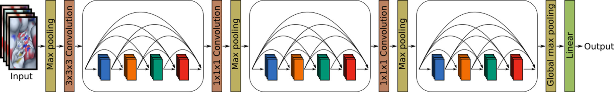

# DenseFS



This repository contains our (re)implementation of [Protein family-specific models using deep neural networks and transfer learning improve virtual screening and highlight the need for more data](https://pubs.acs.org/doi/10.1021/acs.jcim.8b00350) (DenseFS).

If you found DenseFS useful, please cite our paper:

[Imrie F, Bradley AR, van der Schaar M, Deane CM. Protein family-specific models using deep neural networks and transfer learning improve virtual screening and highlight the need for more data, Journal of Chemical Information and Modeling. 2018, 58(11), 2319-2330.](https://pubs.acs.org/doi/10.1021/acs.jcim.8b00350)

This implementation utilises [libmolgrid](https://pubs.acs.org/doi/10.1021/acs.jcim.9b01145) for molecular gridding.

# Requirements

This code was tested in Python 3.7 with PyTorch 1.4.

A yaml file containing all requirements is provided. This can be readily setup using conda.

```
conda env create -f DenseFS-env.yml
conda activate DenseFS-env
```

# Models supported

We have implemented two CNN architectures, which can be found in `models.py`. These are specified when using the scripts by --model / -m.

Ragoza - This refers to the three-layer CNN architecture described in [Ragoza et al., 2017](https://pubs.acs.org/doi/10.1021/acs.jcim.6b00740).

Imrie - This refers to the DenseNet-based CNN architecture described in [Imrie et al., 2018](https://pubs.acs.org/doi/10.1021/acs.jcim.8b00350).

# Example usage

## Train from scratch (using random weights)
```
python CNN_train.py -m Imrie --train_file ./data/small.types -d ./data/structs/ -i 500 -b 32 -s 42 --display_iter 50 --save_iter 500 --anneal_iter 100 --rotate --translate 2.0
```

## Train from pretrained model (using existing/trained weights)
```
python CNN_train.py -m Imrie --train_file ./data/small.types -d ./data/structs/ -i 250 -b 32 -s 42 --display_iter 50 --save_iter 250 --anneal_iter 100 --weights model.iter-500 --base_lr 0.005 --rotate --translate 2.0
```

## Test
```
python CNN_test.py -m Imrie --weights model.iter-250 --test_file ./data/small.types -d ./data/structs/ -b 32 -s 42 --display_iter 50 --rotate --num_rotate 4
```

# Contact (Questions/Bugs/Requests)

Please submit a Github issue or contact Fergus Imrie [imrie@stats.ox.ac.uk](mailto:imrie@stats.ox.ac.uk).
